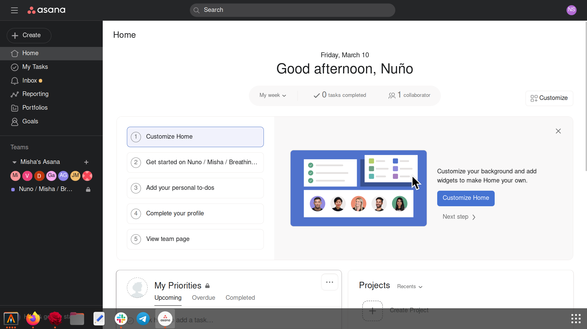

## About 

This is a project for creating a desktop app for Asana on Linux, and in particular on Ubuntu/Debian (although the idea should be easily adaptable to other systems). The core idea is to use [rose](https://github.com/mini-rose/rose), a minimalistic browser written in C based on webkit2 and gtk, in the same way that one would use Chrome for Electron. But the advantage is that on my system rose takes ~68M of memory, whereas slack takes something like ~733M.

Technical requirements are medium. You should be familiar with Linux systems and willing to debug things yourself if and when you get any errors. But your beard need not be long.



## Built with

- [rose](https://github.com/mini-rose/rose)

## Getting started

### Requirements

Install [rose](https://github.com/mini-rose/rose):

```
git clone https://github.com/mini-rose/rose
cd rose
bash build.sh
sudo bash install.sh
```

When the above doesn't work, you may want to either apply or take inspiration from [these instructions](https://github.com/mini-rose/rose/blob/master/user-scripts/ubuntu-20.04/install-with-dependencies.sh) for installing rose with its dependencies in Ubuntu 20.04.

### Installation

Once you've installed rose to `/bin/rose`, install this repository:

```
git clone https://git.nunosempere.com/NunoSempere/asana-for-linux.git
cd asana-for-linux
sudo ln -sf /bin/rose /bin/asana ## this is so that the xdg-open gods recognize asana as its own thing
chmod +x asana.desktop
```

then edit asana.desktop to point to the location of `assets/asana-logo-round.png` on your system.

```
sudo cp asana.desktop /usr/share/applications
```

Then you should wait for a bit until the xdg-open gods recognize the asana app in the Ubuntu/Debian search bar.

## FAQ

**Is this legal? Do you own the copyright for the Asana logo?**

I'm guessing that the Asana people are not going to care either way

**What is the status of this repository?**

This repository is provided as is. I don't make any guarantees of merchantability. I consider it pretty much feature complete.

**Why did you do this?**

Because I was bored and I find programming projects relaxing.

## To do 

- Make it so that typing the `asana` command on the command line also opens the asana app.

## Contributing

Contributions are welcome

## License

Distributed under the MIT License
